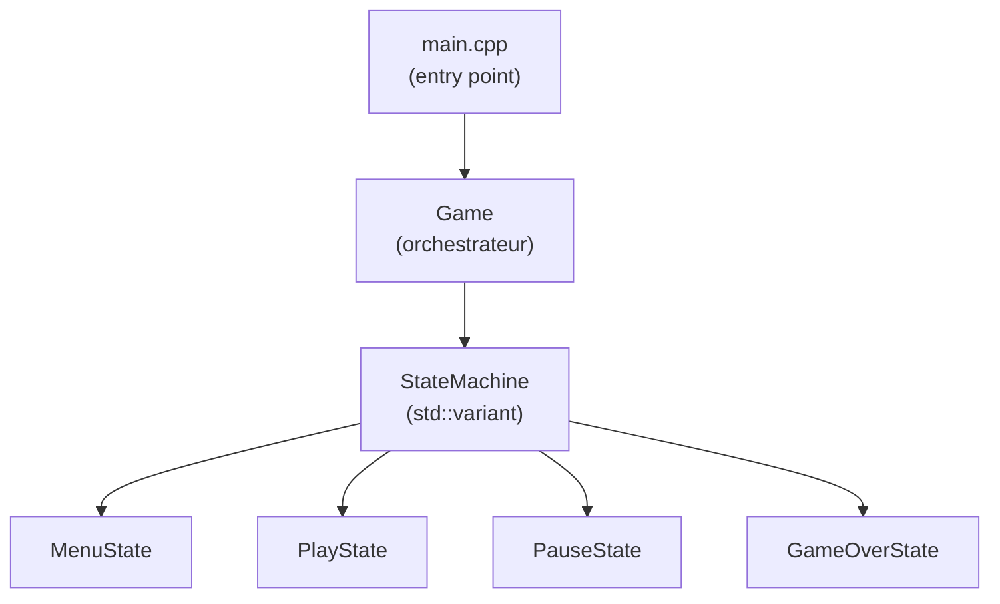
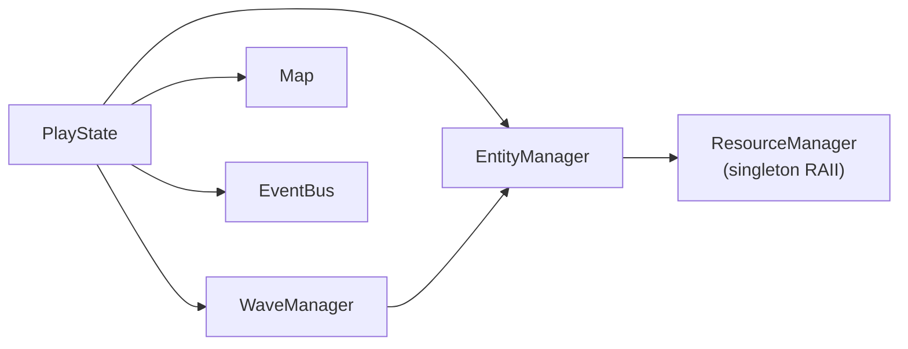
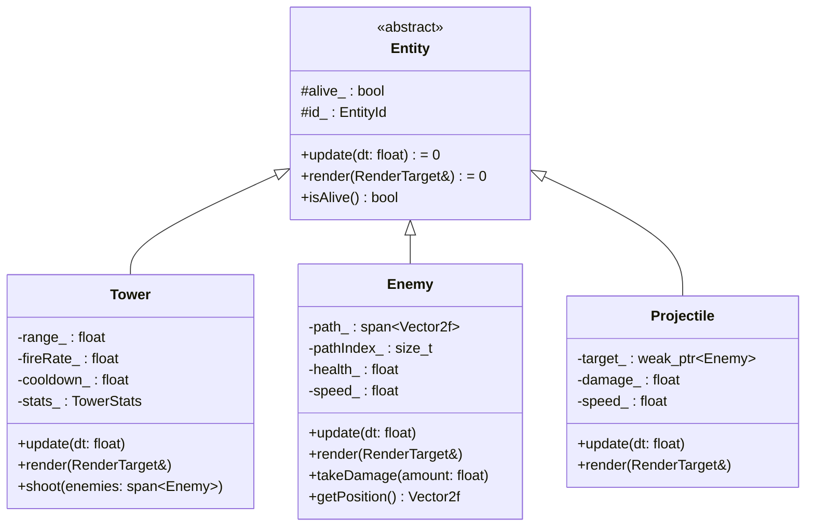
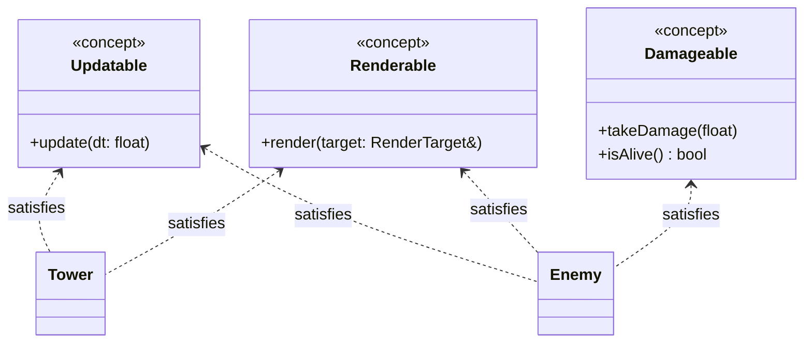
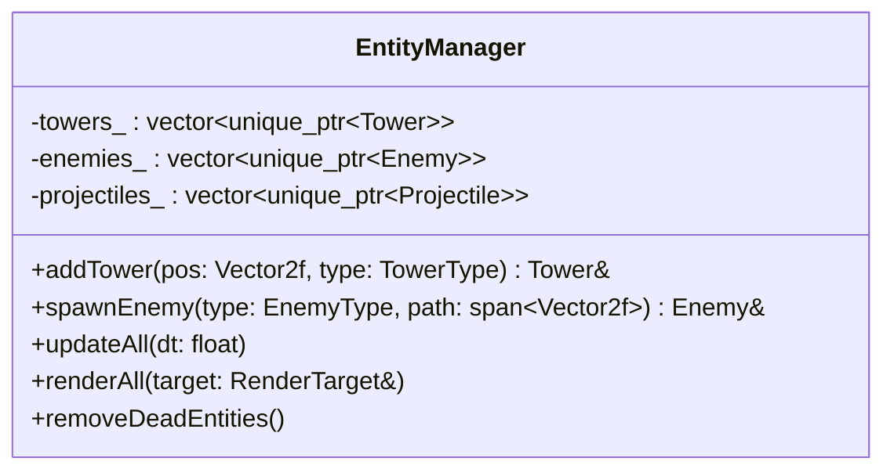
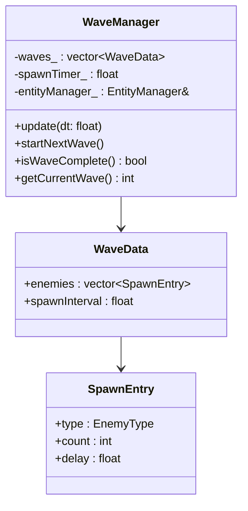
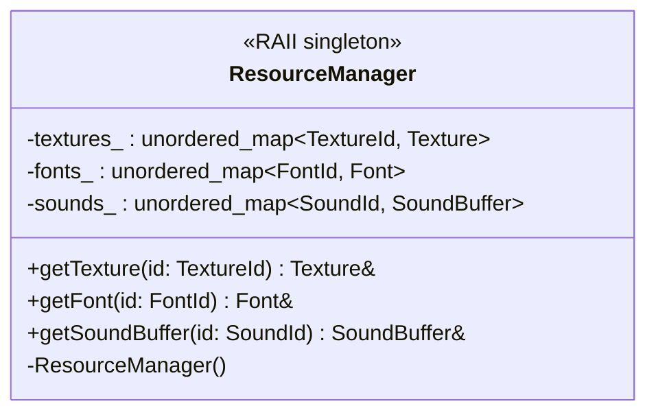
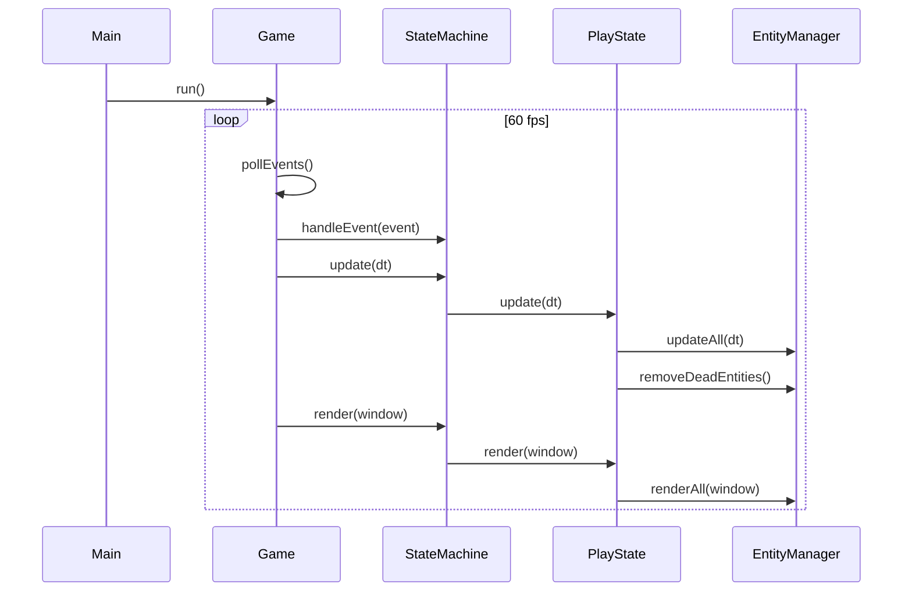

# Architecture

## C++20 Principles Applied

- **Concepts** — template constraints (`Updatable`, `Renderable`, `Damageable`)
- **`std::span`** — pass ranges without copies
- **RAII** everywhere — no raw `new`/`delete`, only `unique_ptr` / `shared_ptr`
- **Composition > inheritance** — `Entity` is a lightweight base; behaviors live in components
- **`std::variant` + `std::visit`** — State Machine without pure virtuals
- **Logic / render separation** — `defender_lib` has no display dependency

---

## Overview



---

## Game State — PlayState



---

## Entity Hierarchy



---

## C++20 Concepts



---

## EntityManager



---

## WaveManager



---

## EventBus (Decoupling)

```mermaid
classDiagram
    class EventBus {
        <<singleton>>
        +subscribe~T~(handler: function) HandlerId
        +unsubscribe(HandlerId)
        +emit~T~(event: T)
        -handlers_ : unordered_map
    }

    class EnemyReachedBase { +damage: float }
    class EnemyKilled { +reward: int }
    class TowerPlaced { +pos: Vector2f }
    class WaveStarted { +waveNumber: int }

    EventBus ..> EnemyReachedBase : emits
    EventBus ..> EnemyKilled : emits
    EventBus ..> TowerPlaced : emits
    EventBus ..> WaveStarted : emits
```



---

## ResourceManager



---

## Game Loop



---

## File Structure

```
src/
├── core/
│   ├── Game.hpp / Game.cpp
│   ├── StateMachine.hpp          ← std::variant<MenuState, PlayState, ...>
│   └── EventBus.hpp              ← template header-only
├── states/
│   ├── MenuState.hpp / .cpp
│   ├── PlayState.hpp / .cpp
│   ├── PauseState.hpp / .cpp
│   └── GameOverState.hpp / .cpp
├── entities/
│   ├── Entity.hpp                ← abstract base
│   ├── Tower.hpp / .cpp
│   ├── Enemy.hpp / .cpp
│   └── Projectile.hpp / .cpp
├── managers/
│   ├── EntityManager.hpp / .cpp
│   ├── WaveManager.hpp / .cpp
│   └── ResourceManager.hpp / .cpp
├── map/
│   ├── Map.hpp / .cpp
│   └── Tile.hpp
└── defender_lib.cpp              ← CMake stub
```
